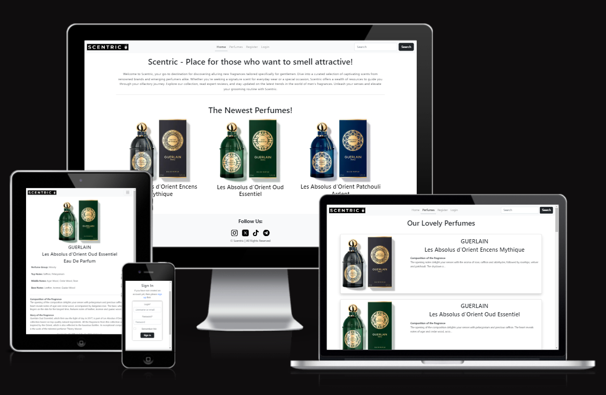
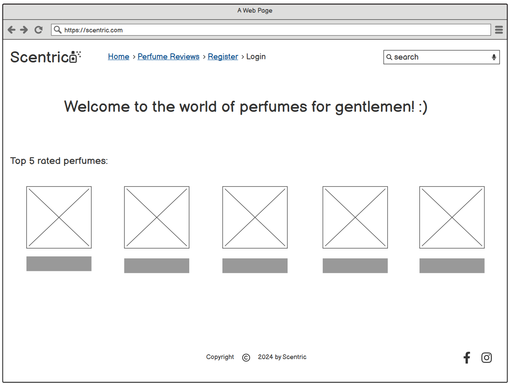
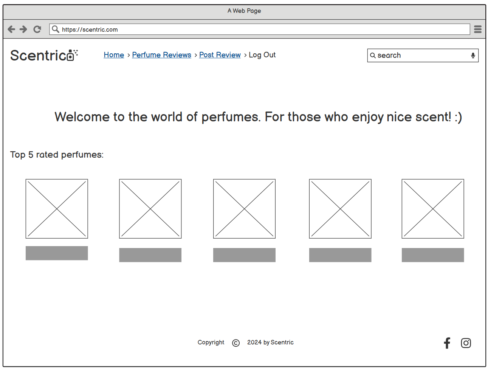
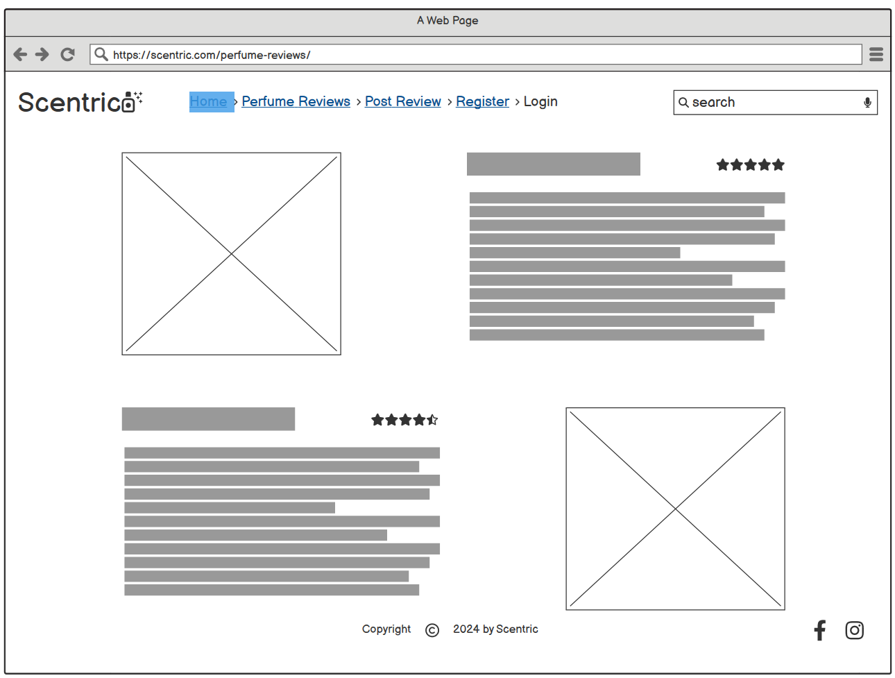
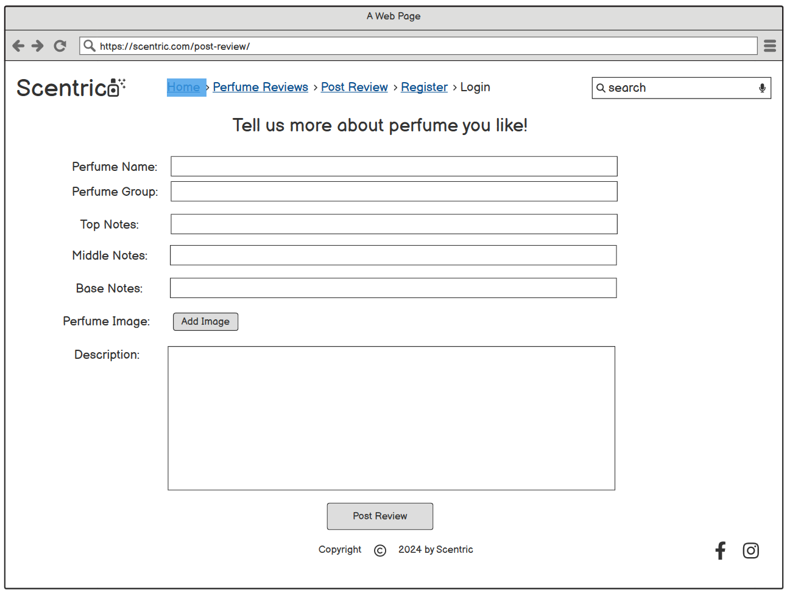
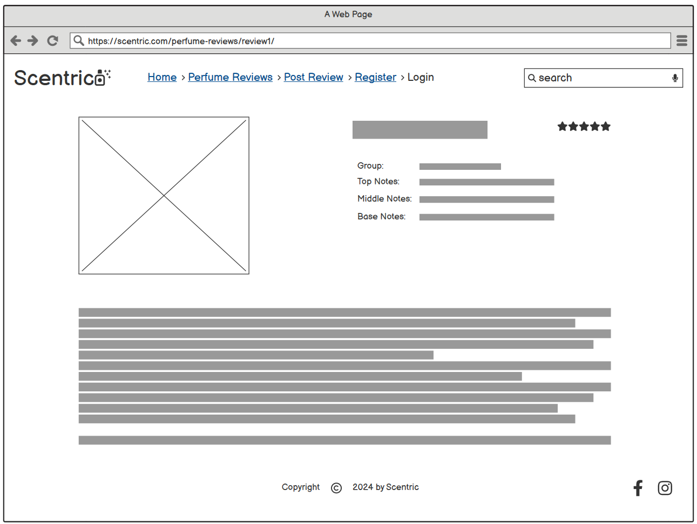
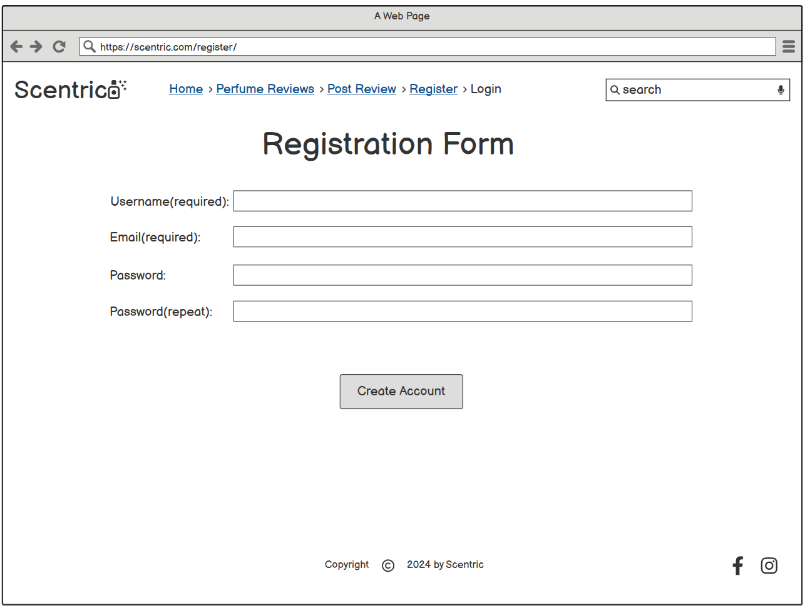
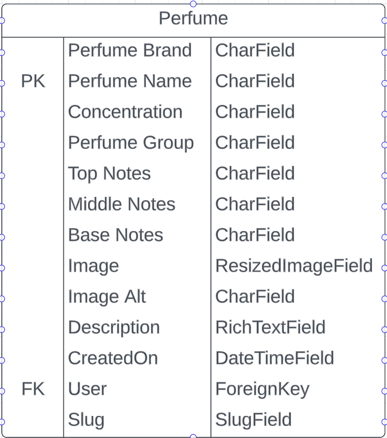

# SCENTRIC

Scentric is an imaginary perfume blog-like site, where users can find out about new, interesting perfumes or share their favourite perfumes with others. Place for those gentlemen who want to smell nice.

[SCENTRIC live project here.](https://scentric-b4e3bf0a3dae.herokuapp.com/)

# Table of Content
* [Development process](#development-process)
  * [Development Preparation](#development-preparation)
  * [Agile Development](#agile-development)
  * [Git](#git)
* [Features](#features)
  * [Navigation Bar](#navigation-bar)
  * [Search](#search)
  * [Latest Perfumes](#latest-perfumes)
  * [Perfumes List](#main-article-list)
  * [Detailed Perfume View](#article-detail)
  * [Register](#register)
    * [Validation](#validation)
  * [Login](#login)
  * [Footer](#footer)
* [Testing](#testing)
  * [Manual Testing](#manual-testing)
  * [Validation](#validation)
    * [Python](#python)
    * [HTML](#html)
    * [CSS](#css)
    * [JS](#js)
  * [Bugs](#bugs)
* [Deployment](#deployment)
  * [Deployment Preparation](#deployment-preparation)
  * [Setup](#setup)
* [Credits](#credits)
  * [Used Technologies and Tools](#used-technologies-and-tools)
  * [Django Apps](#django-apps)
  * [Content and Media](#content-and-media)
* [Acknowledgments](#acknowledgments)

## Development process
While planning the project I tried to follow an agile development approach as much as I could.

### Development Preparation
When I set my mind to make blog-like site about perfumes:
- At first, I created wireframes for my site so that I can have visual idea of how I want my site to looke like.

    

    
Home Page Not Logged In
    

    
    

    

    
Home Page Logged In
    

    
    

    

    
Perfumes Page
    

    
    

    

    
Add Perfume Page
    

    
    

    

    
Perfume Detail Page
    

    
    

    

    
Registration Form Page
    

    
    

    

    
Login Page
    

    
    

* Then I created ERD for my Perfume model:

  

    
ERD for Perfume Model
    

    
    

* After that I've created the most of my User stories with appropriate labels, which can be found here:
[Scentric Project](https://github.com/users/AleksandarJavorovic/projects/5)

### Agile Development
- While developing, I chose one issue to work on from the "Todo" column of the MVP board and moved it into the "In Progress" column.
- After I was done with the issue by fulfilling all the acceptance criteria, I moved the issue into the "Done" Column.

### Git
- I started the project by using the [gitpod python template](https://github.com/Code-Institute-Org/python-essentials-template) provided by the Code Insitute.
- Then I regularly staged my changes using the command `git add .` and then committed the staged changes to my local repository using `git commit -m 'short descriptive message here'`.
- Finally, I pushed the commits to the GitHub repository using the command `git push`.