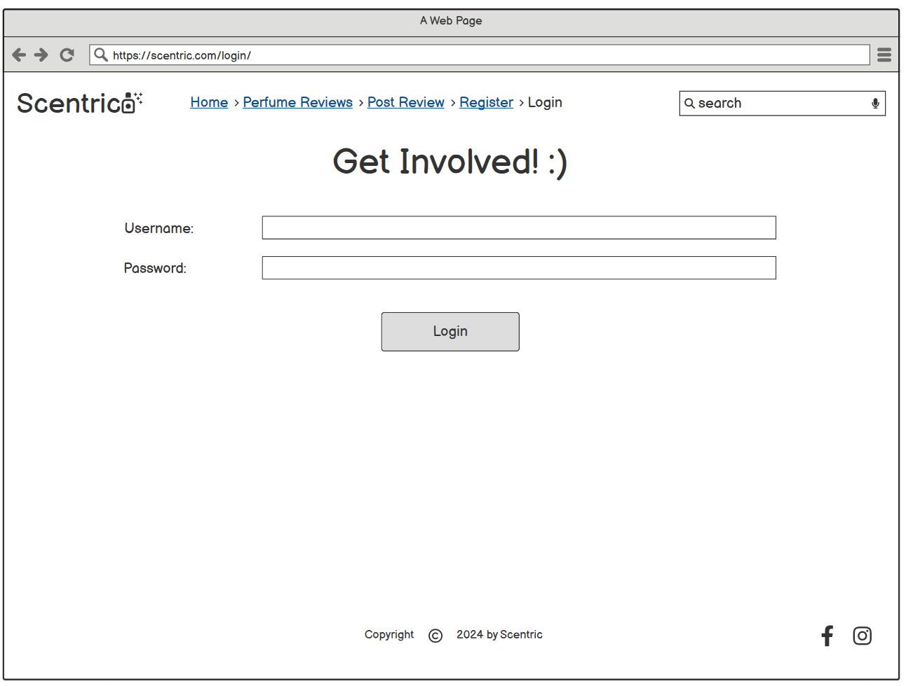
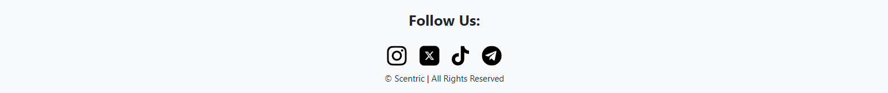

# SCENTRIC

Scentric is an imaginary perfume blog-like site, where users can find out about new, interesting perfumes or share their favourite perfumes with others. Place for those gentlemen who want to smell nice.

[SCENTRIC live project here.](https://scentric-b4e3bf0a3dae.herokuapp.com/)

# Table of Content
* [Development process](#development-process)
  * [Development Preparation](#development-preparation)
  * [Agile Development](#agile-development)
  * [Git](#git)
* [Features](#features)
  * [Navigation Bar](#navigation-bar)
  * [Search](#search)
  * [The Newest Perfumes](#the-newest-perfumes)
  * [Perfumes List](#perfumes-list)
  * [Detailed Perfume View](#detailed-perfume-view)
  * [Add Perfume](#add-perfume)
  * [Registration](#registration)
  * [Validation](#validation)
  * [Login](#login)
  * [Footer](#footer)
  * [403 and 404 Page](#403-404-page)
  * [Future Features](#future-features)
* [Testing](#testing)
  * [Manual Testing](#manual-testing)
  * [Validation](#validation)
    * [Python](#python)
    * [HTML](#html)
    * [CSS](#css)
    * [JS](#js)
  * [Bugs](#bugs)
* [Deployment](#deployment)
  * [Deployment Preparation](#deployment-preparation)
  * [Setup](#setup)
* [Credits](#credits)
  * [Used Technologies and Tools](#used-technologies-and-tools)
  * [Django Apps](#django-apps)
  * [Content and Media](#content-and-media)
* [Acknowledgments](#acknowledgments)

## Development process
While planning the project I tried to follow an agile development approach as much as I could.

### Development Preparation
When I set my mind to make blog-like site about perfumes:
- At first, I created wireframes for my site so that I can have visual idea of how I want my site to looke like.

    

    
Home Page Not Logged In
    

    
    

    

    
Home Page Logged In
    

    
    

    

    
Perfumes Page
    

    
    

    

    
Add Perfume Page
    

    
    

    

    
Perfume Detail Page
    

    
    

    

    
Registration Form Page
    

    
    

    

    
Login Page
    

    
    

* Then I created ERD for my Perfume model:

  

    
ERD for Perfume Model
    

    
    

* After that I've created the most of my User stories with appropriate labels, which can be found here:
[Scentric Project](https://github.com/users/AleksandarJavorovic/projects/5)

### Agile Development
- While developing, I chose one issue to work on from the "Todo" column of the MVP board and moved it into the "In Progress" column.
- After I was done with the issue by fulfilling all the acceptance criteria, I moved the issue into the "Done" Column.

### Git
- I started the project by using the [gitpod python template](https://github.com/Code-Institute-Org/python-essentials-template) provided by the Code Insitute.
- Then I regularly staged my changes using the command `git add .` and then committed the staged changes to my local repository using `git commit -m 'commit message text'`.
- Finally, I pushed the commits to the GitHub repository using the command `git push`.

## Navigation Bar

- The navigation bar as well as footer are present on all of the pages.
- The Navbar contains Scentric Logo which is clickable and functions as a home page button. In the middle of the navbar we have Home Page, Perfumes Page, Register and Login page for the non authenticated users.
- At the right side of the navbar is search-box, used to find desired perfume revive.

 
- After user logs in, Add Perfume Page and Logout Page are being presented, as well as message giving feedback to the user about successfull authentication.

## Search 

- As mentioned search bar is present within the navbar and can be used to find specific perfume.
- It functions so that it will go through the Perfume Brands, Names, Top Notes, Middle Notes, Base Notes or Perfume Group and search for the given word.
- User will be taken to the Perfumes Page and if found perfume/s will be presented on the page.

## The Newest Perfumes

- This feature is present at the home page, it presents three last perfumes being added to the site.
- Each one is presented with the image and name of the perfume.
- Perfume Images/Names are clickable and they are redirecting user to the detailed view of the given perfume.

## Perfumes List

- Perfumes page is sort of a list of perfumes, present at the moment, with the last added perfume being at the top of the list.
- Each perfume on the list, is presented as a card containing:image, perfume brand, perfume name and beginning of the perfume description just to attract user to enter and find out more about the specific perfume.

## Detailed Perfume View

- This feature is kind of enriched version of the previous one.
- Detailed Perfume View consist of: image, perfume brand, perfume name, concentracion,perfume group, top notes, middle notes, base notes and description.
- The look of the description depends on the user's imagination.

- In case that your are the creator of the perfume review(post), you will be able to see 2 additional buttons Edit and Delete. Thanks to them you will be able to update or delete your own posts.
- Edit button will take you to form to edit your post which is identical as the one to add perfume(post) to the site.

- Delete button will take user to the delete confirmation page. After pressing confirm, the perfume review will be deleted.

## Add Perfume

- This page is presented to the authenticated users and it is a form for adding the perfume to the site.
- The form contains next fields:
  - Perfume Brand
  - Concentracion
  - Perfume Name
  - Perfume Group
  - Top Notes
  - Middle Notes
  - Base Notes
  - Perfume Image
  - Image Description
  - Description

- All of the fields are obligatory to be filled in.

## Registration

- Registration/Signup page are pretty simple and easy to understand.

## Validation

- All fields have to be filled in and in case the username is taken, or password is too common feedback mechanism will inform the user about it.

## Login

- As mentioned to be able to post or edit/delete your Perfume review, you need to be logged in.
- Form is simple with a username/email line and password.
- User can choose if he wants to be "remembered".

## Logout

- Logout/Sign out page is very simple, user needs to click the "Sign Out" button, after that he will be logged out and sent to the home page.

## Footer

- Footer is also pretty minimalistic, having icons, presenting social networks links and name of the site, as well as trademark symbol.
- Links to the Social Networks are opened in the new tab, according to the UI/UX design.

## 403 and 404 Pages

- Custom 403 Page is also there in case someone tries to delete something which does not belong to him.

- Custom 404 Page is also present in case someone tries to open non-existing page.

## Future Features
- Adding comments to the site, where authenticated users are able to comment on other persons perfume review/comments.
- Adding rating system, where users would be able to rate other people perfumes.
- Add filters to the searching feature.